# MicroCall - Microsoft Teams Clone
This is a project developed as a part of Microsoft Engage'21 Mentorship program. With the help of my mentors and seniors, I was able to complete the project on time. It was an exciting and insighful journey with a lot of learning. An experience of its kind!
 
**Main Challenge**: A minimum of two participants should be able connect with each other using your product to have a video conversation.

* [Group Video Conferencing - Video/Audio stream](#meeting-room-group-call)
* [Join/Create Call Room](#new-call-or-join-room)
* [Meet Chat](#meeting-chats)
* [Authorization](#sign-up-or-log-in)
* [Chat(Rooms) without meet](#chat-dashboard-after-log-in)
* [Screen Sharing](#screen-share)
* [File Sharing](#share-file)
* [Screen Recording](#screen-recorder)
* [Call Time and Kick Out person](#call-time-and-hand-raise)
* [WhiteBoard](#whiteboard)
* [Other Settings](#other-settings)

## Website link for demo 
[Teams Clone Microcall](https://microcall.herokuapp.com/)

# Agile Methodology
As the theme was Agile Methodology, the project has been completed by using SCRUM method, tasks divided for each week, and Sprints carried out. A different private repo was made for the earlier commits and this repo is for the final project.
Testing and debugging was done through Katalon Studio. The project was made using WebRTC, an open-source project and specification that enables real-time media communications like voice, video and data transfer natively between browsers and devices.
 

## **Week 1**
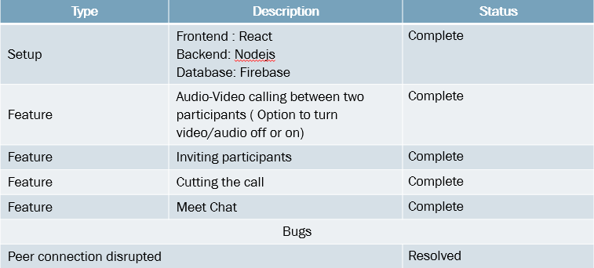
## **Week 2**
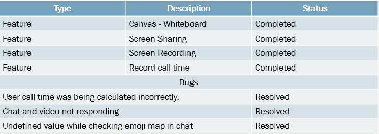
## **Week 3**
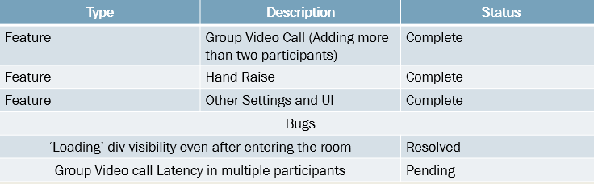
## **Week 4**
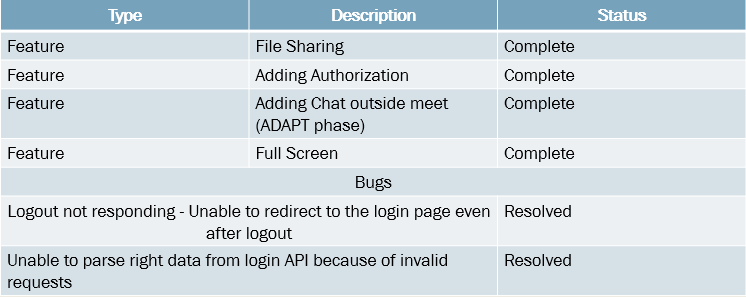

# Installation and Running
1. `npm install` 
2. `nodemon run server.js` or `npm run dev`
3. Create a .env file:
   * Add `API_KEY_SECRET=YourApiKeySecret`
   * Add Turn Server - not necessary ( Go to http://numb.viagenie.ca to get your initials and Set `TURN_ENABLED=true`)  
     `TURN_ENABLED=true|false`  
      `TURN_URLS=turn:numb.viagenie.ca`  
      `TURN_USERNAME=YourNumbUsername`  
      `TURN_PASSWORD=YourNumbPassword`  

# Features

## Home
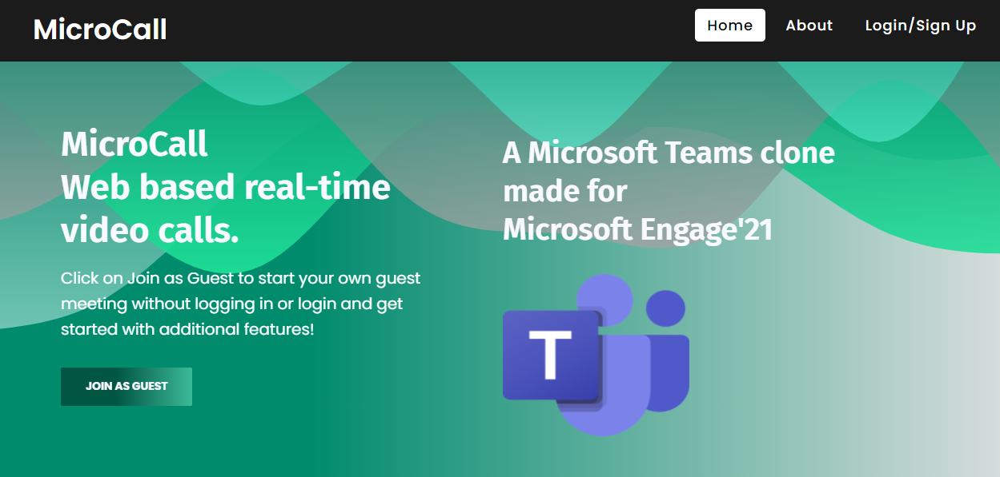

## Sign Up or Log In
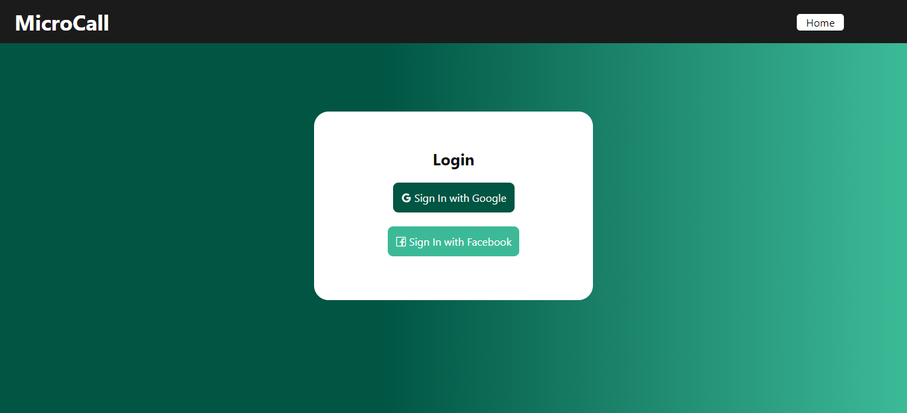

## Chat Dashboard After Log In
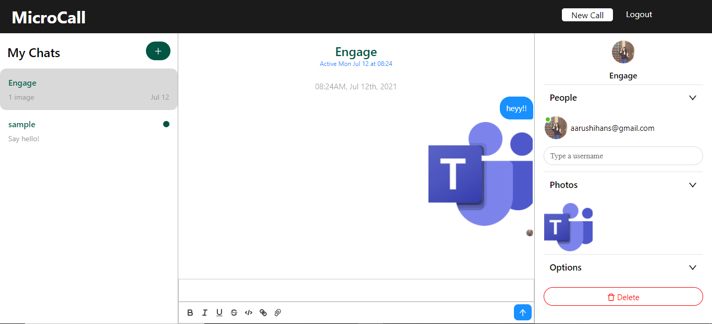

## New Call Or Join room
### Enter the Room Name here to join the room
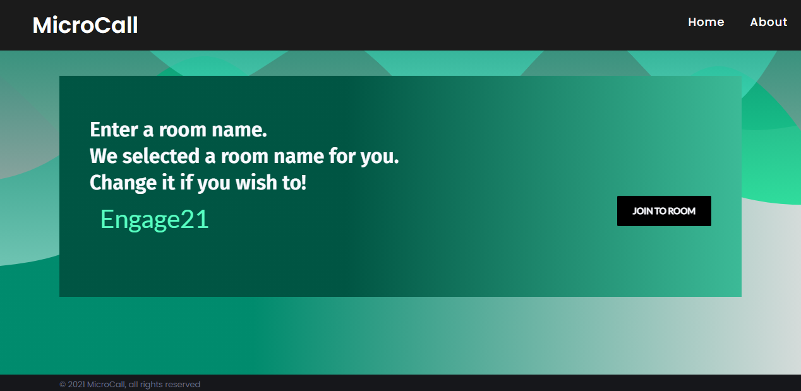

## Meeting Room Group Call 
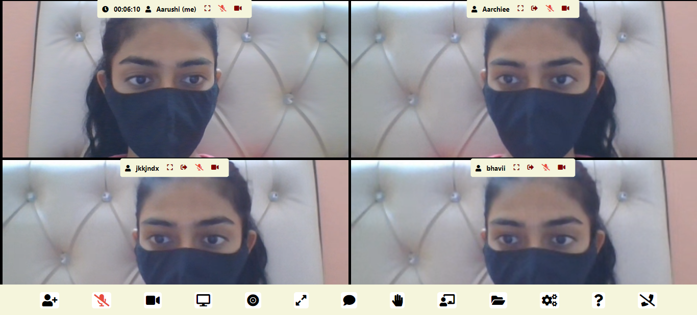

## Meeting chats
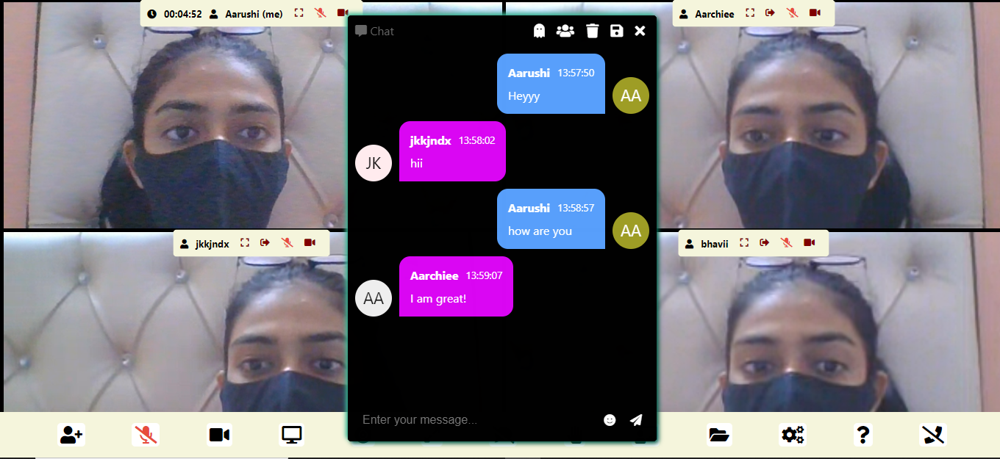

## Screen Share
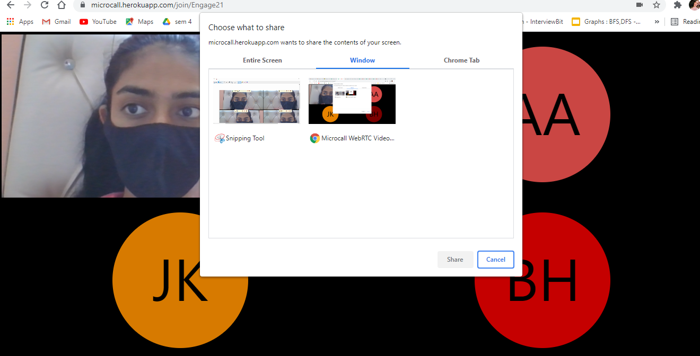
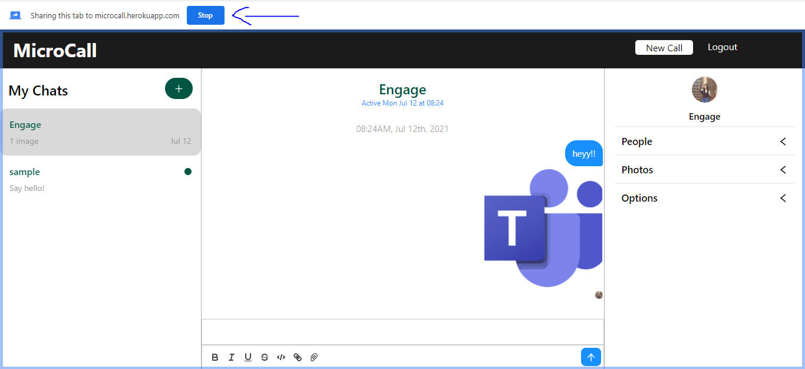

## Screen Recorder
### By clicking the icon, Screen record will start, and as in when you end the screen recording by clicking on the button agai, the file will be saved in you PC
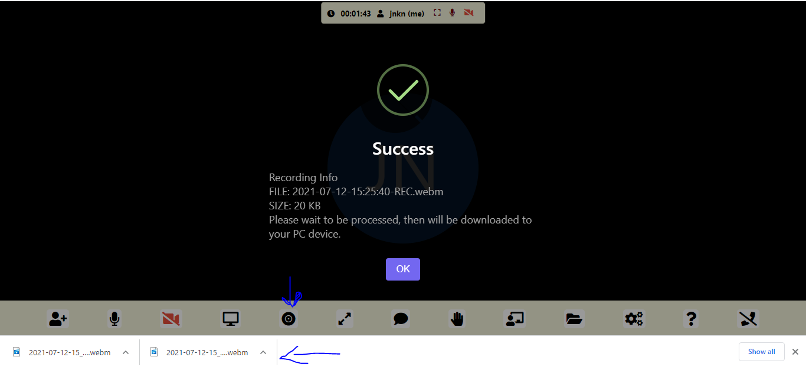

## Whiteboard
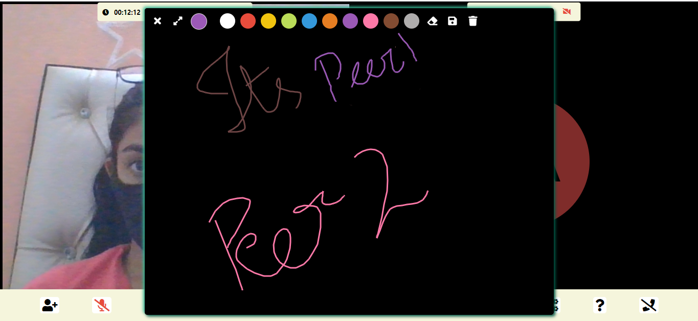

## Share File
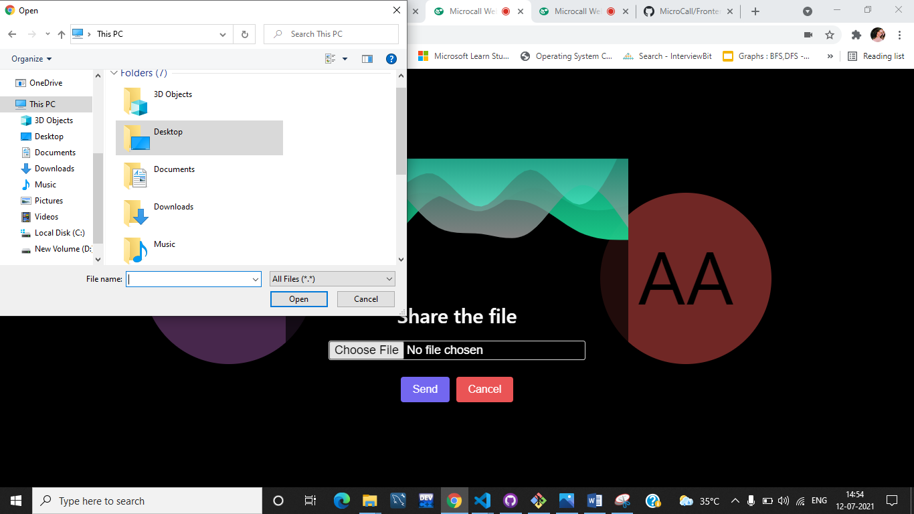
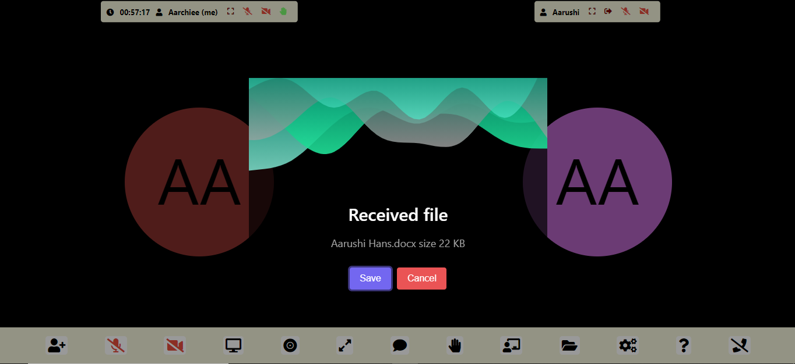

## Call Time and Hand Raise
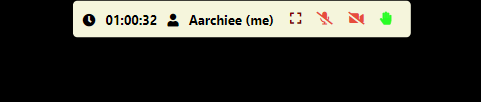
### Raise hand by clicking on the icon
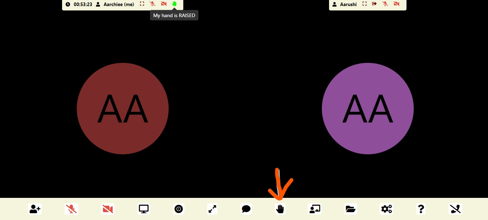

## Other settings
### Done through DetectRTC
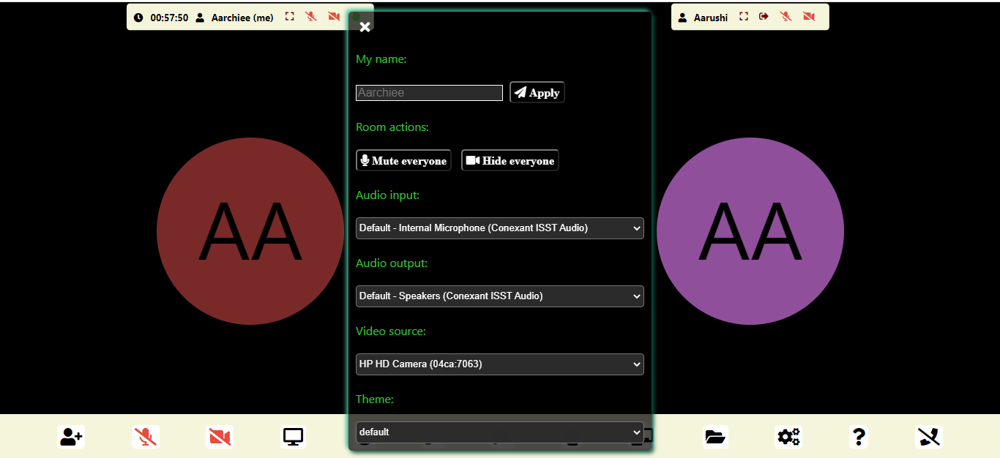
